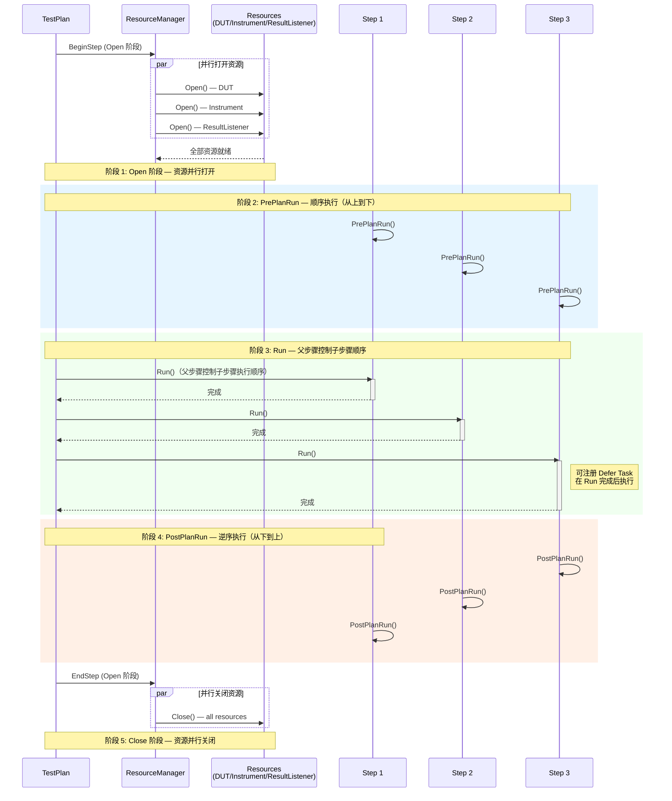

# 架构概览

## 什么是 OpenTAP

OpenTAP 是一个用于快速开发和执行自动化测试与校准算法的软件解决方案。它通过控制测量仪器和被测设备（DUT），利用 C#/.NET 的特性及高度可扩展的架构，最大限度地减少开发者需要编写的代码量。

OpenTAP 提供了一套完整的基础设施，用于配置、控制和执行测试算法，并通过丰富的 API 支持以 TestStep、Instrument、DUT 等形式实现插件。

## 核心组件

OpenTAP 由以下可执行组件构成：

| 组件 | 说明 | 代码位置 |
|------|------|----------|
| **OpenTAP.dll** | 核心引擎，所有插件的基础依赖 | `Engine/` |
| **CLI** | 命令行接口，执行测试计划、设置外部参数 | `Cli/` |
| **Package Manager** | 包的安装、卸载、创建与分发 | `Package/` |
| **tap** | tap 可执行程序宿主 | `tap/` |
| **SDK** | 开发工具包（MSBuild 集成、项目模板） | `sdk/` |

## 核心类体系

OpenTAP 引擎定义了以下核心类（均位于 `Engine/` 目录下）：

| 核心类 | 职责 | 源文件 |
|--------|------|--------|
| **TestPlan** | 测试计划，XML 序列化为 `.TapPlan` 文件，是执行的顶层容器 | `Engine/TestPlan.cs` |
| **TestStep** | 测试步骤的抽象基类，所有步骤继承自它。提供 `Run`、`PrePlanRun`、`PostPlanRun` 生命周期方法 | `Engine/TestStep.cs` |
| **Resource** | 资源的基类，DUT 和 Instrument 均继承自它 | `Engine/Resource.cs` |
| **DUT** | 被测设备抽象 | `Engine/Dut.cs` |
| **Instrument** | 测量仪器抽象 | `Engine/Instrument.cs` |
| **PluginManager** | 插件搜索、加载与管理的静态类，搜索可执行目录下的程序集 | `Engine/PluginManager.cs` |
| **ComponentSettings** | 组件级配置设置 | `Engine/ComponentSettings.cs` |
| **ResultListener** | 结果监听器，订阅测试计划执行中的结果数据 | `Engine/ResultListener.cs` |
| **TestPlanRun** | 单次测试计划运行的状态容器，管理资源和线程 | `Engine/TestPlanRun.cs` |
| **TestPlanExecution** | 测试计划执行引擎（`TestPlan` 的 partial class），编排从 Open 到 Close 的完整生命周期 | `Engine/TestPlanExecution.cs` |

## 项目目录结构

```
opentap/
├── Engine/               # 核心引擎
│   ├── TestStep.cs       # 步骤基类
│   ├── TestPlan.cs       # 测试计划
│   ├── TestPlanExecution.cs  # 执行引擎
│   ├── PluginManager.cs  # 插件管理器
│   ├── ComponentSettings.cs  # 组件设置
│   ├── Resource.cs       # 资源基类
│   ├── Dut.cs            # DUT
│   ├── Instrument.cs     # 仪器
│   ├── ResultListener.cs # 结果监听器
│   ├── TestPlanRun.cs    # 运行状态
│   ├── ResourceTaskManager.cs  # 资源并行管理
│   ├── TestStepRun.cs    # 步骤运行状态
│   ├── Annotations/      # Annotation 系统（反射元数据）→ [[Annotation系统]]
│   └── SerializerPlugins/ # 序列化插件
├── BasicSteps/           # 内置基础步骤
│   ├── SequenceStep.cs   # 顺序执行
│   ├── ParallelStep.cs   # 并行执行
│   ├── RepeatStep.cs     # 重复执行
│   ├── SweepLoop.cs      # 参数扫描循环
│   ├── IfStep.cs         # 条件分支
│   ├── LockStep.cs       # 互斥锁
│   ├── DelayStep.cs      # 延时
│   ├── DialogStep.cs     # 对话框交互
│   ├── ScpiStep.cs       # SCPI 命令
│   ├── TimeGuardStep.cs  # 超时保护
│   └── TestPlanReference.cs  # 测试计划引用
├── Cli/                  # 命令行入口
├── Package/              # 包管理器
├── Shared/               # 共享工具类
├── tap/                  # tap 可执行宿主
├── sdk/                  # SDK 工具（MSBuild、模板）
├── tests/                # 集成测试计划（.TapPlan）
└── doc/                  # 文档
```

## 插件系统

> 详见 [[插件开发入门]]

OpenTAP 的插件是其灵活架构的核心。插件可以是以下任意类型的组合：

- **TestStep** — 测试步骤
- **Instrument** — 测量仪器
- **DUT** — 被测设备
- **ResultListener** — 结果监听器
- **ComponentSettings** — 组件设置

`PluginManager` 负责搜索和加载插件，默认在运行的可执行文件所在目录中搜索程序集。可以通过 `PluginManager.DirectoriesToSearch` 添加额外的搜索路径（参见 `Engine/PluginManager.cs` 第 35 行）。

插件以 **Package**（包）的形式分发，包是插件的版本化集合。包的安装、卸载、创建通过 Package Manager 完成（参见 `Package/` 目录）。

## 执行流程

> 详见 [[TestPlan与生命周期]]

测试计划的执行遵循严格的生命周期。以下 Mermaid 图描述了完整的执行流程：



### 生命周期关键点

1. **Open 阶段** — 所有 DUT、Instrument 和配置的 ResultListener **并行**打开。由 `Engine/TestPlanExecution.cs` 第 649 行的 `OpenInternal` 方法触发，`ResourceTaskManager` 协调并行操作。
2. **PrePlanRun** — 所有步骤的 `PrePlanRun()` 方法**顺序**执行，按测试计划中从上到下的顺序。实现于 `Engine/TestPlanExecution.cs` 第 18 行 `RunPrePlanRunMethods` 方法。
3. **Run** — 每个步骤的 `Run()` 方法执行。父步骤控制其子步骤的执行顺序（例如 `SequenceStep` 顺序执行子步骤，`ParallelStep` 并行执行子步骤）。步骤可在 `Run()` 中注册 **延迟任务（Defer Task）**，在 `Run()` 完成后、当前阶段结束前执行（`Engine/TestStep.cs`）。
4. **PostPlanRun** — 所有步骤的 `PostPlanRun()` 方法**逆序**执行，从最后一个步骤向前遍历。实现于 `Engine/TestPlanExecution.cs` 第 265 行：`for (int i = run.StepsWithPrePlanRun.Count - 1; i >= 0; i--)`。注意 PostPlanRun 在 `finishTestPlanRun` 方法中执行，与子步骤同样递归处理。
5. **Close 阶段** — 所有已打开的资源**并行**关闭。由 `ResourceTaskManager` 协调。

> [!important] 子步骤递归
> PrePlanRun 在执行完当前步骤后递归执行其 `ChildTestSteps`（第 57 行）；Run 由父步骤自行决定何时调用子步骤；PostPlanRun 通过 `StepsWithPrePlanRun` 列表统一按逆序处理，其中包括所有层级的步骤。

## 外部参数

标记为 **External** 的步骤设置可以通过 CLI、GUI 编辑器或 API 在运行时设置（参见 `Engine/ExternalParameterAttribute.cs`、`Engine/ExternalParameters.cs`）。这允许用户在运行时动态调整关键参数，无需修改测试计划文件。

示例 CLI 使用：
```bash
tap run MyPlan.TapPlan --external "StepName.SettingName=NewValue"
```

## 手动资源连接

资源支持**手动打开**模式：通过 GUI 编辑器的 **Connection** 按钮预先打开资源，使其在多次测试计划运行之间保持连接状态，从而消除每次运行的 Open/Close 开销。

> [!warning] 使用手动连接时，必须确保资源可以安全地在多次运行间保持打开状态。例如，如果 `Dut.Open()` 会重置 DUT 配置，则可能不适合手动保持连接。

相关代码路径：`Engine/Resource.cs`（资源基类）、`Engine/ResourceTaskManager.cs`（资源并行管理）、`Engine/TestPlanExecution.cs` 第 847 行 `Close()` 方法（手动关闭资源入口）。

## 多 DUT 测试

通过层次化测试步骤和 `AllowChildrenOfType` 属性，OpenTAP 支持复杂的多 DUT 测试流程。四种典型模式：

1. **纯顺序** — TX/RX 步骤按 DUT 依次重复
2. **TX 作为 RX 的子步骤** — RX 控制多 DUT，TX 作为子步骤嵌入
3. **并行变体 1** — 复用 TX/RX 功能但更优化的流程
4. **并行变体 2** — 进一步优化的并行多 DUT 流程

代码参考：`Engine/ChildItemVisibility.cs`（`AllowChildrenOfType` 属性）、`Engine/Dut.cs`、`BasicSteps/ParallelStep.cs`。

## 相关笔记

- [[TestStep详解]] — TestStep 基类深度解析（接口、属性、生命周期）
- [[TestPlan与生命周期]] — 测试计划完整生命周期详解
- [[插件开发入门]] — 如何开发 OpenTAP 插件
- [[Annotation系统]] — Annotation 反射元数据系统
- [[PluginManager深度解析]] — 插件搜索与加载机制
- [[BasicSteps一览]] — 内置基础步骤的功能与用法
- [[PackageManager]] — 包管理与分发
