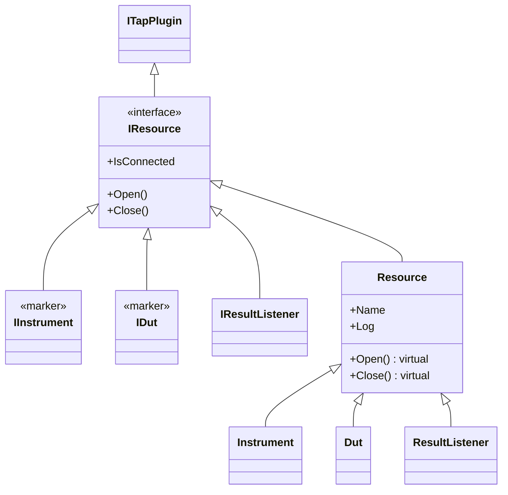

# Resource 与仪器/DUT

## 概述

OpenTAP 用于**硬件与软件测试**，Instrument（仪器）和 DUT（被测设备）是其核心资源抽象。它们遵循统一的 `IResource` 接口，由引擎自动管理生命周期。

## 接口层次



## 资源基类

```csharp
public abstract class Resource : ValidatingObject, IResource
{
    public string Name { get; set; }
    public bool IsConnected { get; }
    public virtual void Open() { }
    public virtual void Close() { }
    protected TraceSource Log { get; }
}
```

## Instrument（仪器）

```csharp
public abstract class Instrument : Resource, IInstrument
{
    // 默认名称: "INST"
    // 用于测量、信号生成、数据采集等
}
```

**内置 SCPI 支持**:
```csharp
public class ScpiInstrument : Instrument, IScpiInstrument
{
    public void ScpiCommand(string cmd) { }
    public string ScpiQuery(string query) { }
}
```

## DUT（被测设备）

```csharp
public abstract class Dut : Resource, IDut
{
    [MetaData] public string ID { get; set; }
    [MetaData] public string Comment { get; set; }
}
```

## 自动资源注入

TestStep 构造时自动从 Bench 配置注入资源：

```csharp
public class MeasurePower : TestStep
{
    // 自动从 InstrumentSettings (Bench) 中注入第一个匹配的仪器
    public ScpiInstrument Dmm { get; set; }
    
    // 自动从 DutSettings (Bench) 中注入
    public MyDut Device { get; set; }
    
    public override void Run()
    {
        var v = Dmm.ScpiQuery(":MEAS:VOLT:DC?");
        Results.Publish("Voltage", ["DCV"], v);
    }
}
```

## 资源打开控制

```csharp
// 控制资源打开时机
[ResourceOpen(ResourceOpenBehavior.Before)]      // 在父资源之前（默认）
[ResourceOpen(ResourceOpenBehavior.InParallel)]  // 与父资源并行
[ResourceOpen(ResourceOpenBehavior.Ignore)]      // 不自动打开
public ScpiInstrument Scope { get; set; }
```

## Manual Resource Connection

资源可以手动打开，跨多次 TestPlan 运行保持连接：

1. 在 GUI 中点击 **Connection** 按钮手动连接
2. 手动打开的资源在 TestPlan 运行之间保持 `Open` 状态
3. 消除重复打开/关闭的时间开销
4. 需确保资源支持此使用模式

## 多 DUT 测试模式

```
选项1: 顺序 ──→ [DUT1 TX→RX] [DUT2 TX→RX]
选项2: 嵌套 ──→ [RX(DUT1,DUT2) [TX(DUT1)]]  
选项3: 并行 ──→ [DUT1 TX] [DUT2 TX] (同时)
                 [DUT1 RX] [DUT2 RX] (同时)
```

利用 `ParallelStep` + 层级设计可实现灵活的 DUT 并行拓扑。

## ResultListener（结果监听器）

`IResultListener` 也是资源，生命周期遵循相同的 Open/Close 模式：

```csharp
public interface IResultListener : IResource
{
    void OnTestPlanRunStart(TestPlanRun planRun);
    void OnTestPlanRunCompleted(TestPlanRun planRun, Stream logStream);
    void OnTestStepRunStart(TestStepRun stepRun);
    void OnTestStepRunCompleted(TestStepRun stepRun);
    void OnResultPublished(Guid stepRunId, ResultTable result);
}
```

内置 ResultListener:
- **Text Log** — 保存日志到文件
- **CSV** — 保存结果到 CSV
- **SQLite / PostgreSQL** — 持久化到数据库

## Bench 配置

资源在 Settings 面板中配置，存储在 `Settings/` 目录：

| 配置文件 | 说明 |
|----------|------|
| `Settings/Instruments.xml` | 仪器列表（InstrumentSettings） |
| `Settings/Duts.xml` | DUT 列表（DutSettings） |
| `Settings/Results.xml` | ResultListener 列表（ResultSettings） |

## 相关笔记

- [[TestStep详解]] — 如何在步骤中使用资源
- [[TestPlan与生命周期]] — 资源在生命周期中的位置
- [[架构概览]] — 整体架构

## 参考

- 源码: [Engine/Resource.cs](Engine/Resource.cs), [Engine/Instrument.cs](Engine/Instrument.cs), [Engine/Dut.cs](Engine/Dut.cs)
- 源码: [Engine/ScpiInstrument.cs](Engine/ScpiInstrument.cs)
- 文档: [doc/Developer Guide/Resources/Readme.md](doc/Developer Guide/Resources/Readme.md)
