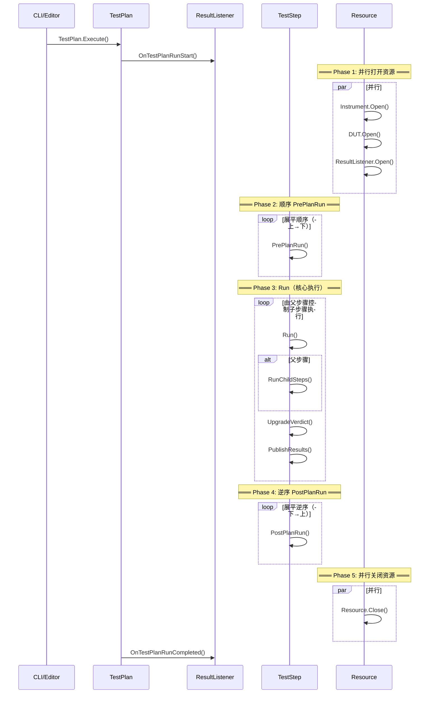

# TestPlan 与生命周期

## 概述

TestPlan 是 OpenTAP 的顶层执行单元，是一个**递归的测试步骤树**。存储为 XML 格式的 `.TapPlan` 文件。

## TestPlan 结构

```xml
<!-- .TapPlan 文件本质是序列化的 TestPlan 对象 -->
<TestPlan type="OpenTap.TestPlan">
  <Steps>
    <Step type="OpenTap.Plugins.BasicSteps.SequenceStep">
      <Name>My Sequence</Name>
      <ChildTestSteps>
        <Step type="MyPlugin.MeasurePower">
          <Frequency>1000000000</Frequency>
        </Step>
      </ChildTestSteps>
    </Step>
  </Steps>
</TestPlan>
```

## 完整执行生命周期



## 各阶段详解

### Phase 1: 资源打开（并行）

```csharp
// 资源管理器并行打开所有引用的资源
// 可通过 ResourceOpenAttribute 控制打开行为:
[ResourceOpen(ResourceOpenBehavior.InParallel)]  // 并行
[ResourceOpen(ResourceOpenBehavior.Before)]       // 在父资源之前（默认）
[ResourceOpen(ResourceOpenBehavior.Ignore)]       // 忽略
```

### Phase 2: PrePlanRun（顺序）

- 所有步骤的 `PrePlanRun()` 按树结构**展平后从上到下**顺序执行
- 适合：配置仪器、初始化 DUT 状态、检查前置条件
- 如果某个步骤的 PrePlanRun 抛出异常，后续步骤的 PrePlanRun **不会执行**，但已执行过的步骤仍会调用 PostPlanRun

### Phase 3: Run（父步骤控制）

- **这是唯一由父步骤控制执行顺序的阶段**
- 父步骤通过 `RunChildSteps()` 或 `RunChildStep()` 决定子步骤的执行方式
- Parallel 步骤用 `TapThread.Start()` 并行执行子步骤
- 步骤可以发布结果、设置判定、记录日志

### Phase 4: PostPlanRun（逆序）

- 确保嵌套资源的**正确清理顺序**（先子后父）
- 如果 PrePlanRun 被调用了，PostPlanRun **保证被调用**（即使发生异常）

### Phase 5: 资源关闭（并行）

- 所有打开的资源并行关闭
- 可以通过 Engine Settings 配置超时

## 异常处理

```
Run() 中抛出异常
  → TestPlan 捕获异常
    → 步骤 Verdict → Error
    → 根据 EngineSettings.AbortTestPlan 决定是否继续
      → 继续：执行下一个步骤
      → 中止：跳过剩余步骤，进入 PostPlanRun
```

## Break Conditions（中断条件）

通过 `EngineSettings` 配置，可针对每种 Verdict 独立设置：

| 条件 | 默认 | 说明 |
|------|------|------|
| Break On Error | ✅ 启用 | Error 时中止计划 |
| Break On Fail | ❌ 禁用 | Fail 时中止计划 |
| Break On Inconclusive | ❌ 禁用 | Inconclusive 时中止计划 |

中断时：
1. 当前层级的执行立即停止
2. 对应的 Verdict 向上传播
3. 找到不触发 Break Condition 的父步骤后恢复执行
4. 如果传播到 TestPlan 级别，整个计划停止

## 多 DUT 场景

OpenTAP 支持多种并行/顺序 DUT 测试模式：

- **Flow Option 1**: 顺序执行，每个 DUT 依次测试（操作员可并行换件）
- **Flow Option 2**: TX 作为 RX 的子步骤，RX 控制多个 DUT
- **Flow Option 3/4**: 优化的组合并行模式

利用步骤层级 + `AllowChildrenOfType` + `ParallelStep` 可实现灵活的 DUT 测试拓扑。

## 外部参数（External Parameters）

```bash
# CLI 传入外部参数
tap run test.TapPlan -e "Frequency=10MHz" -e "Power=-10dBm"
```

标记为 External 的步骤设置可被 CLI、GUI、API 在运行时覆盖。

## 相关笔记

- [[架构概览]] — 顶层架构图
- [[TestStep详解]] — 步骤的开发模式
- [[Verdict与判定系统]] — 判定传播机制
- [[Resource与仪器DUT]] — 资源管理详解

## 参考

- 源码: [Engine/TestPlan.cs](Engine/TestPlan.cs), [Engine/TestPlanExecution.cs](Engine/TestPlanExecution.cs)
- 文档: [doc/Developer Guide/What is OpenTAP/Readme.md](doc/Developer Guide/What is OpenTAP/Readme.md)
- 文档: [doc/User Guide/Introduction/Readme.md](doc/User Guide/Introduction/Readme.md)
