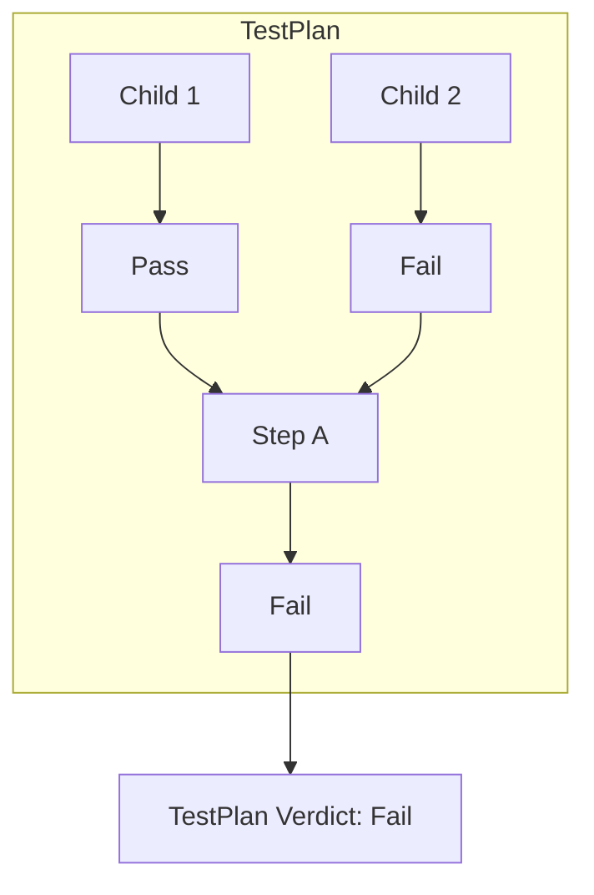

# Verdict 与判定系统

## Verdict 枚举

```csharp
public enum Verdict
{
    NotSet = 0,       // 未设置（初始值）
    Pass = 10,        // 通过
    Inconclusive = 20, // 不确定（数据不足）
    Fail = 30,        // 失败
    Aborted = 40,     // 用户中止
    Error = 50        // 错误（异常）
}
```

严重度递增：`NotSet < Pass < Inconclusive < Fail < Aborted < Error`

## UpgradeVerdict

只升级不降级：

```csharp
public override void Run()
{
    UpgradeVerdict(Verdict.Pass);   // NotSet → Pass
    // ...
    UpgradeVerdict(Verdict.Fail);   // Pass → Fail (升级)
    UpgradeVerdict(Verdict.Pass);   // 仍为 Fail (不降级)
}
```

## 判定传播



- 父步骤默认取**所有直接子步骤中最严重的判定**
- `RunChildSteps()` 自动执行此逻辑
- 可通过 `throwOnBreak: false` 后手动覆盖 `Verdict` 属性
- 判定从子向父逐级传播，不跨层级

## 覆盖默认判定

```csharp
public override void Run()
{
    RunChildSteps(throwOnBreak: false);
    // 强制设置为 Pass（例如恢复策略）
    Verdict = Verdict.Pass;
}
```

## Break Conditions

### 引擎设置

在 `EngineSettings` 中配置，可独立启用/禁用：

| 中断条件 | 触发时机 |
|----------|----------|
| Break On Error | Error 判定时中断 |
| Break On Fail | Fail 判定时中断 |
| Break On Inconclusive | Inconclusive 判定时中断 |

默认仅启用 **Break On Error**。

### 步骤级别覆盖

每个 TestStep 可覆盖父级的中断条件：

```
Sequence (Break On Error)          ← 全局设置
├── Child1                         ← 继承 Break On Error
├── Parallel (Break On Fail)       ← 覆盖：中断 Fail
│   ├── Child2                     ← 继承 Break On Fail
│   └── Child3                     ← 继承 Break On Fail
└── Child4                         ← 继承 Break On Error
```

### 中断传播

```
Child 产生 Fail
  → 父 Parallel (Break On Fail 启用)
    → Parallel 停止执行
    → Fail 向上传播到 Sequence
      → Sequence (Break On Fail 未启用)
        → 继续执行后续步骤 Child4
```

## 在代码中检查判定

```csharp
// 检查当前步骤判定
if (Verdict >= Verdict.Fail)
    return;  // 提前退出

// 检查是否被中止
TapThread.ThrowIfAborted();

// 手动中止
PlanRun.MainThread.Abort();
```

## 相关笔记

- [[TestStep详解]] — UpgradeVerdict 的使用
- [[TestPlan与生命周期]] — 中断在生命周期中的行为
- [[架构概览]] — Verdict 在整个流程中的位置

## 参考

- 源码: [Engine/Verdict.cs](Engine/Verdict.cs)
- 文档: [doc/User Guide/Introduction/Readme.md](doc/User Guide/Introduction/Readme.md) (Verdicts 节)
